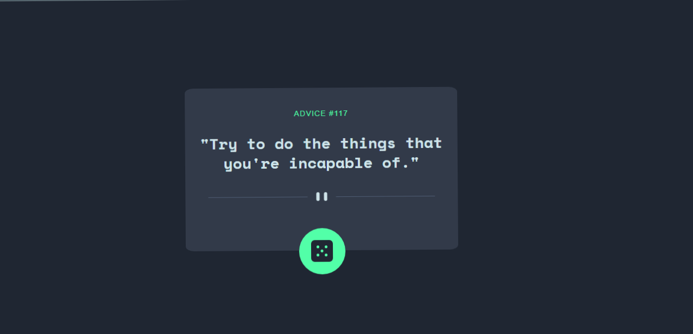

#Advice generator app 

## Table of contents

- [Overview](#overview)
  - [Screenshot](#screenshot)
  - [Links](#links)
  - [Built with](#built-with)
  - [What I learned](#what-i-learned)
  - [Author](#author)
  - [Acknowledgments](#acknowledgments)

## Overview
This is a interesting advice generator app by which you can seek some great advices and change your life by implementing them.
I've used HTML, CSS and Vanilla JavaScript to create it. It is fully responsive webpage.It uses API to generate quotes.

### Screenshot



### Links

- Live Site URL: [Add live site URL here](https://your-live-site-url.com)

### Built with

- Semantic HTML5 markup
- CSS custom properties
- Flexbox
- Desktop-first workflow
- Google Fonts


### What I learned
I have learned how to use fetch method for using API.


```js
 fetch('https://api.adviceslip.com/advice')
    .then(response => response.json())
    .then(data => {
    quote = `${data.slip.advice}`;
    num = `${data.slip.id}`;
    advice_box.innerText = `"${quote}"`;
});
}
```

## Author

- Website - [SAGAR SHARMA](https://sagar-io.github.io)
- Instagram - [sagar_pandit_26](https://www.instagram.com/sagar_pandit_26)

## Acknowledgments

Thanks to FrontEndMentor for helping me to find out some inspiration for creating this kind of project.
